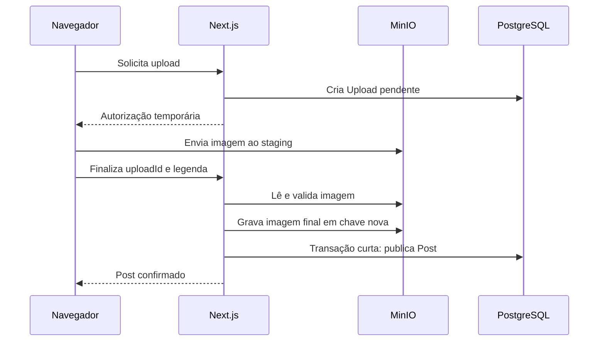
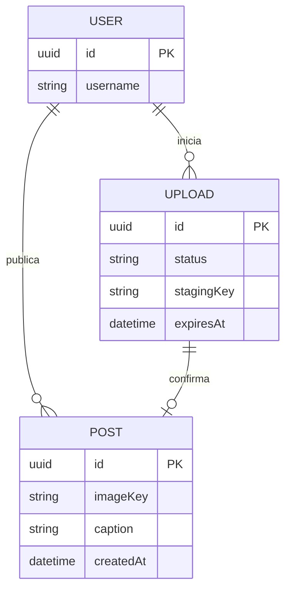

# Exercício 1: completar a publicação de uma foto

## A feature

Complete a implementação desta feature: publicar uma foto com legenda opcional. No feed, o usuário abre “Nova publicação”, seleciona uma imagem, confere a prévia, escreve a legenda e publica. Depois da confirmação, a foto deve aparecer no feed e na própria galeria.

O navegador, a aplicação Next.js, o MinIO e o PostgreSQL participam desse fluxo. A infraestrutura já está preparada; neste exercício, você completa a coordenação da interface em React.

### Requisitos funcionais

O exercício atende ao **RF-01: publicar uma imagem com legenda opcional e encontrá-la na galeria própria e no feed**.

- Selecionar uma imagem JPEG, PNG ou WebP não vazia de até 10 MiB e visualizar sua prévia.
- Escrever uma legenda opcional de até 2.200 pontos de código após `trim`.
- Publicar a foto e consultar o resultado nas páginas de feed e galeria já prontas.
- Repetir uma confirmação após falha ou iniciar outra tentativa quando necessário.

A validação local está pronta. O servidor também verifica o conteúdo real da imagem, aceita apenas imagens estáticas de até 20 megapixels e 8.192 px por dimensão e prepara o arquivo final.

### Requisitos não funcionais

- **Usabilidade:** mostrar progresso, erro e sucesso; impedir outro envio e o fechamento do diálogo durante a operação.
- **Recuperação:** permitir nova tentativa após falhas, preservando o necessário para recuperar uma confirmação.
- **Integridade:** repetir uma confirmação compatível não deve criar outra publicação.
- **Acessibilidade:** preservar rótulos, mensagens anunciadas e uso por teclado.
- **Persistência e segurança:** usar a infraestrutura pronta, que guarda imagens no MinIO e metadados no PostgreSQL, valida autoria e mantém credenciais no servidor. O navegador recebe apenas a autorização temporária necessária ao upload.

### Contrato e fluxo

Os endpoints ficam sob `/api/v1`. Use as funções prontas de `client-api.ts` para acessá-los.

Uma publicação reúne dois tipos de dados: o arquivo da imagem e os metadados, como autor e legenda. O MinIO armazena os arquivos; o PostgreSQL armazena os metadados; a aplicação Next.js oferece a API. O navegador apresenta o formulário e usa as funções prontas para se comunicar com esses serviços.

Uma **tentativa de upload** é identificada por `uploadId`. Um **post** é a publicação confirmada, com identificador próprio. Esses termos aparecem nos contratos abaixo e representam momentos diferentes do fluxo.

**Autorização: `POST /api/v1/uploads`**

- Recebe `{ contentType, sizeBytes }`, obtidos do arquivo selecionado.
- Cria uma tentativa de upload pertencente ao usuário atual.
- Retorna `201` com `{ uploadId, uploadUrl, fields, uploadUrlExpiresAt, expiresAt }`.
- A autorização para enviar o arquivo dura 10 minutos. A tentativa pode ser finalizada por uma hora.

**Envio da imagem ao MinIO**

A função `uploadImage(file, authorization)` envia os campos assinados e o arquivo para `uploadUrl`. O arquivo fica no staging privado. Concluir esse envio ainda não significa que o post foi publicado.

**Confirmação: `POST /api/v1/posts`**

- Recebe `{ uploadId, caption? }`.
- Valida autoria, expiração, legenda e conteúdo real da imagem, prepara o arquivo final e registra a publicação.
- Retorna `201` com `PostDTO` ao criar a publicação.
- Repetir o mesmo `uploadId` e a mesma legenda normalizada retorna `200` com o post existente. Alterar a legenda de uma publicação já confirmada retorna `409`.

`PostDTO` contém o identificador do post, autor, URL e dimensões finais da imagem, legenda, data e campos sociais usados pelos cartões prontos.

**Como o formulário recebe os resultados**

`finalizePublication` recebe `PublicationSubmission`, com `uploadId` e `caption`, e retorna uma destas formas:

```ts
{ success: true, post: PostDTO }
{ success: false, message: string, restartUpload: boolean }
```

`message` contém uma mensagem para o usuário. `restartUpload` informa se a tentativa exige um novo envio do arquivo. Falhas de conexão podem lançar exceções em vez de retornar esse resultado.

Esses contratos descrevem os recursos disponíveis. Cabe ao grupo decidir como representar cada situação no React, quais dados manter e como oferecer a próxima ação ao usuário. O guia adiante ajuda a investigar essas decisões.

### Diagrama de sequência

O staging é a área privada que recebe a imagem antes de sua validação e publicação. Use o diagrama para entender as responsabilidades; as funções prontas da API cuidam da comunicação.



### Entidades e relações



## Onde trabalhar

Altere somente [publish-form.tsx](../src/features/publication/publish-form.tsx), nos trechos indicados por TODO. Validação, seleção com prévia, estilos e infraestrutura estão preparados. Use as funções de API existentes; preserve os contratos e os componentes visuais.

Os arquivos abaixo estão em `src/features/publication/`:

| Arquivo                                                              | O que procurar                                                                                |
| :------------------------------------------------------------------- | :-------------------------------------------------------------------------------------------- |
| [publish-form.tsx](../src/features/publication/publish-form.tsx)     | Estados, evento `submit`, helpers `selectImage` e `showPublicationSuccess`, condições do JSX. |
| [image-picker.tsx](../src/features/publication/image-picker.tsx)     | Props `file`, `disabled` e callback `onSelect`; seleção e prévia prontas.                     |
| [caption-field.tsx](../src/features/publication/caption-field.tsx)   | Props `value`, `disabled` e callback `onChange`; campo e contagem prontos.                    |
| [publish-dialog.tsx](../src/features/publication/publish-dialog.tsx) | Como o diálogo fornece `onPendingChange` ao formulário e usa essa informação.                 |
| [client-api.ts](../src/features/publication/client-api.ts)           | Funções de comunicação e tipos `PublicationSubmission` e `PublicationResult`.                 |
| [contracts.ts](../src/features/publication/contracts.ts)             | `UploadAuthorization`, `PostDTO` e limite `MAX_IMAGE_BYTES`.                                  |

Em `client-api.ts`, você encontrará:

| Função                | Recebe                         | Retorna quando resolvida |
| :-------------------- | :----------------------------- | :----------------------- |
| `requestUpload`       | `File`                         | `UploadAuthorization`    |
| `uploadImage`         | `File` e `UploadAuthorization` | `void`                   |
| `finalizePublication` | `PublicationSubmission`        | `PublicationResult`      |

Essas funções também podem lançar exceções. Leia os comentários e os tipos antes de usá-las.

O ambiente e o seed devem estar preparados pelo professor. Comece em `/feed`; use `/gallery` para conferir sua foto. Você pode desenvolver com as listas prontas, sem esperar outro grupo.

## Passo a passo

Use as perguntas enquanto implementa. Não é necessário entregar uma resposta escrita para cada uma. As dicas são apoio caso o grupo trave.

### 1. Entenda quem controla a interação

Leia os três componentes visuais e seus usos em `PublishForm`.

- Ao selecionar uma imagem ou digitar uma legenda, por quais funções o evento passa até a tela mudar?
- Quais responsabilidades ficam no formulário e quais ficam nos filhos?
- Se a operação falhar, como o diálogo ficará sabendo que pode ser fechado?

Dica: siga uma prop e seu callback nos dois sentidos, do pai ao filho e de volta ao pai.

### 2. Planeje o que a tela precisa lembrar

Leia as declarações de estado e as condições do JSX em `publish-form.tsx`.

- Como distinguir uma operação em andamento de uma tentativa parada que ainda pode ser recuperada?
- Quais combinações de botão, legenda e mensagem seriam contraditórias?
- Ao chamar um setter de estado, qual valor a função de evento em execução continua enxergando? Como isso afeta dados que você acabou de receber de uma requisição?

Dica: anote uma situação de sucesso e uma de falha. Para cada uma, descreva o que a tela mostra e quais dados ainda serão necessários. Compare uma variável local com o estado que existirá na próxima renderização.

### 3. Descubra as dependências entre as operações

Leia as assinaturas e os retornos em `client-api.ts`.

- Quais operações dependem do resultado de outras? Quais dados comprovam essa dependência?
- O que muda entre publicar pela primeira vez e tentar recuperar uma publicação?
- Como a interface distingue uma resposta de falha de uma exceção?

Dica: relacione os tipos de entrada e saída. Consulte todos os formatos de `PublicationResult`.

Implemente uma primeira versão e experimente uma publicação válida antes de seguir.

### 4. Faça a interface se recuperar

Examine `selectImage`, `showPublicationSuccess` e o tratamento de erro que falta em `submit`.

- Se cada chamada falhar, o que o usuário poderá fazer em seguida?
- Quais dados devem permanecer disponíveis em cada caso? Quando deixam de representar a tentativa atual?
- Que efeito uma mudança de legenda teria durante a recuperação?
- Quais mensagens precisam desaparecer quando o usuário tenta novamente ou escolhe outra imagem?

Dica: considere separadamente o resultado retornado pela API e uma falha de conexão. Use os contratos para decidir, sem inventar respostas do servidor.

**Decisão do grupo:** escolham quando limpar mensagens antigas ao iniciar uma nova tentativa ou selecionar uma imagem. Justifiquem como a escolha evita mensagens contraditórias e mantém o usuário informado. Preservem as regras de recuperação do contrato.

### 5. Revise o comportamento React

Leia os usos de `pending`, `submitting` e `onPendingChange`.

- O que acontece com a tela se um valor em uma ref muda? E quando um estado muda?
- O que acontece se dois eventos de submissão chegarem antes de uma nova renderização?
- Que partes da proteção já estão prontas? Quais atualizações sua implementação ainda precisa fazer?
- Ao terminar com sucesso, que helper disponível pode ser usado e quais efeitos ele provoca?

Dica: acompanhe um evento do início ao fim, incluindo um retorno antecipado e uma exceção. Confira tanto a tela quanto o diálogo.

## Verificação e demonstração

Use as ferramentas de rede do navegador para acompanhar as chamadas. Não são necessários testes automatizados.

| Cenário                 | Como verificar                                                                                                                                            | Resultado esperado                                                             |
| :---------------------- | :-------------------------------------------------------------------------------------------------------------------------------------------------------- | :----------------------------------------------------------------------------- |
| Publicação válida       | Selecione uma imagem, escreva uma legenda e publique. Depois abra a galeria.                                                                              | Progresso visível, formulário limpo e uma nova foto nas duas páginas.          |
| Entrada inválida        | Cole uma legenda com mais de 2.200 caracteres e tente publicar.                                                                                           | Erro anunciado, nenhuma chamada de publicação e possibilidade de corrigir.     |
| Repetição de clique     | Com rede lenta, tente submeter novamente e fechar o diálogo durante o envio.                                                                              | Uma cadeia de chamadas e diálogo bloqueado até o fim da operação.              |
| Falha de confirmação    | Antes de publicar, bloqueie somente a URL `http://localhost:3000/api/v1/posts` nas ferramentas de rede. Após o erro, retire o bloqueio e tente novamente. | Erro visível e diálogo liberado; a repetição confirma sem novo envio ao MinIO. |
| Nova seleção após falha | Depois de uma falha, selecione outra imagem e observe as mensagens.                                                                                       | A interface passa a representar a nova tentativa conforme a decisão do grupo.  |

O bloqueio da requisição verifica a recuperação na interface. Ele não reproduz uma resposta perdida depois de o servidor já ter publicado.

Na demonstração, mostrem a recuperação e expliquem a decisão sobre mensagens. Identifiquem também quais mudanças de estado causam as alterações visíveis e qual responsabilidade tem a ref.

## Discussão do grupo

Discutam e registrem uma resposta breve para cada pergunta, com uma justificativa. Quando houver alternativas, indiquem uma vantagem e um custo da escolha. Para investigar o servidor, consultem [operations.ts](../src/features/publication/operations.ts) e [image.ts](../src/features/publication/image.ts).

1. O número de usuários enviando fotos cresceu dez vezes. Comparem enviar os arquivos pela aplicação com enviá-los diretamente ao storage. Que recursos e limites vocês avaliariam para escolher?
2. A imagem foi gravada, mas o registro do post falhou. Que resultado o usuário deveria observar? Como vocês tratariam os dados que ficaram em cada sistema?
3. O usuário clicou em publicar, mas não recebeu resposta. Que situações podem ter ocorrido? Que evidências vocês buscariam antes de decidir o comportamento de uma nova tentativa?
4. Duas requisições com o mesmo `uploadId` chegam simultaneamente ao servidor. Que resultado deveria ser produzido? Como vocês verificariam se a implementação mantém esse resultado mesmo com dois navegadores diferentes?
