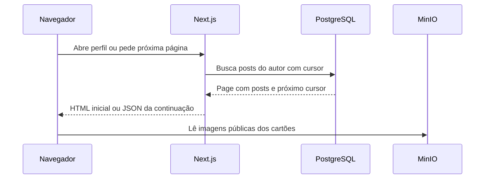
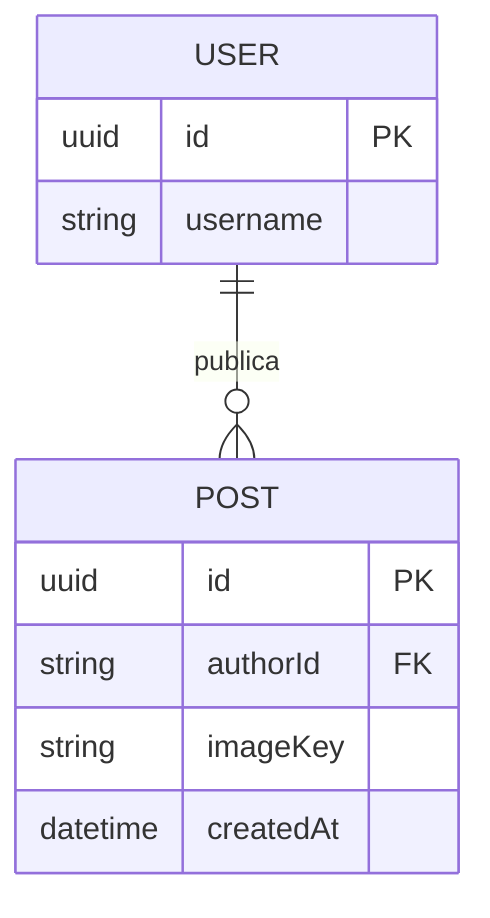

# Exercício 2: consultar um perfil e sua galeria

## A feature

Complete a galeria paginada de um perfil. O usuário abre a própria galeria ou o perfil público de outra pessoa, vê as fotos em cartões quadrados e pode carregar a próxima página. A primeira página, o cartão e a API já estão prontos; o exercício é coordenar a continuação no React.

Esta atividade atende ao **RF-02**. Deve caber em 30–45 minutos.

## Contrato e arquivos disponíveis

`getPostsPage("user", cursor, userId)` retorna `Page<PostDTO>`: `items` contém os novos posts e `nextCursor` informa se há outra página. O cursor é opaco: guarde-o e devolva-o à API sem tentar interpretá-lo.

Altere somente [gallery-post-list.tsx](../src/features/publication/gallery-post-list.tsx), nos TODOs indicados no arquivo.

| Arquivo                                                                    | Papel                                                  |
| -------------------------------------------------------------------------- | ------------------------------------------------------ |
| [gallery-post-list.tsx](../src/features/publication/gallery-post-list.tsx) | Estado, botão e carregamento da próxima página.        |
| [client-api.ts](../src/features/publication/client-api.ts)                 | Função pronta para buscar uma página.                  |
| [contracts.ts](../src/features/publication/contracts.ts)                   | `PostDTO` e `Page`.                                    |
| [post-collection.tsx](../src/features/publication/post-collection.tsx)     | Grade e cartões prontos.                               |
| [gallery/page.tsx](../src/app/gallery/page.tsx)                            | Exemplo de como a primeira página chega ao componente. |

## Fluxo e entidades

## Passo a passo

### 1. O que a interface precisa lembrar?

- Quais props descrevem apenas a primeira renderização?
- Quais valores mudam depois de carregar outra página?
- Qual estado impede dois cliques enquanto a requisição está pendente?

Dica: os posts já visíveis não devem desaparecer quando a próxima página falhar.

### 2. Quando buscar outra página?

- Em que condição o botão deve chamar `getPostsPage`?
- Quais argumentos identificam a galeria e a posição atual?
- Depois do sucesso, os novos itens substituem ou são adicionados aos anteriores?
- Quando o botão deixa de aparecer?

Dica: `nextCursor === null` significa que não há continuação.

### 3. Como tratar a resposta?

- Que mensagem deve aparecer se a função lançar um erro?
- O que deve acontecer com `pending` em sucesso e em falha?
- Por que a tela compara o identificador da requisição antes de aplicar uma resposta?

O contador e a ação de curtir já chegam por composição. Não implemente outra chamada para cada cartão.

### 4. Revise o JSX

- O botão fica desabilitado enquanto carrega?
- A mensagem de erro é anunciada por leitor de tela?
- Uma galeria sem posts continua usando o estado vazio de `PostCollection`?

## Verificação e demonstração

Abra o perfil de Marina, carregue mais uma página e confira 24 fotos sem repetição. Abra Ana para observar a galeria vazia. Com a rede bloqueada apenas para a continuação de posts, confira que os primeiros cartões permanecem e o botão permite nova tentativa.

## Discussão do grupo

1. Por que cursor evita parte dos problemas de uma paginação por offset quando chegam posts novos?
2. Por que a consulta busca `limit + 1` itens?
3. Qual índice ajuda a galeria de um autor e por quê?
4. O cursor cria um retrato imutável da galeria? Qual é a consequência dessa escolha?
