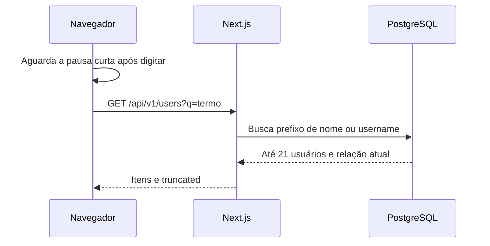
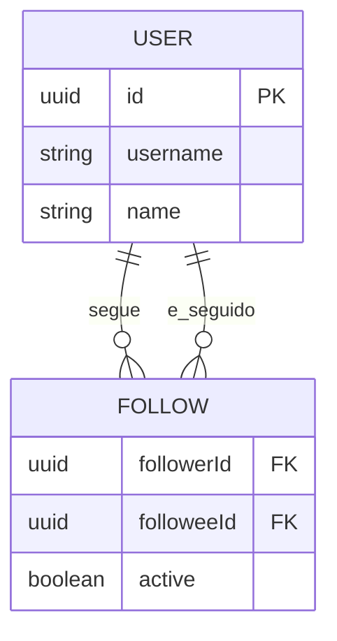

# Exercício 3: buscar pessoas

## A feature

Complete a busca automática de usuários por início de nome ou username. Enquanto a pessoa digita, a tela deve validar o termo, aguardar uma pausa curta, mostrar carregamento e então mostrar resultados, vazio ou erro. A API, os cartões e o pequeno helper de agendamento já estão prontos.

Esta atividade atende ao **RF-03**. Deve caber em 30–45 minutos.

## Contrato e arquivos disponíveis

`searchUsers(term)` retorna `UserSearchResult`, com `items` e `truncated`. A busca aceita termos de 2 a 50 caracteres. `scheduleSearch(callback)` executa a função após 300 ms; você deve decidir quando usá-la, mas não precisa implementar debounce.

Altere somente [search-form.tsx](../src/features/users/search-form.tsx).

| Arquivo                                                          | Papel                                  |
| ---------------------------------------------------------------- | -------------------------------------- |
| [search-form.tsx](../src/features/users/search-form.tsx)         | Estado e evento de alteração do campo. |
| [search-scheduler.ts](../src/features/users/search-scheduler.ts) | Pausa pronta para a consulta.          |
| [client-api.ts](../src/features/users/client-api.ts)             | Busca HTTP pronta.                     |
| [search-results.tsx](../src/features/users/search-results.tsx)   | Resultados, vazio e skeleton prontos.  |

## Fluxo e entidades

## Passo a passo

### 1. Leia o estado antes de programar

- O que representa o texto no input? E o último resultado válido?
- Que estado deve ser limpo assim que o usuário troca o termo?
- Por que um termo com menos de dois caracteres não faz requisição?

### 2. Agende a busca

- Onde a função `scheduleSearch` deve ser chamada?
- Antes de agendar uma nova busca, que timer anterior deve ser cancelado?
- Que valor normalizado deve chegar à API?

O código-base já oferece refs e `fetchResults`. Use-os; não crie um hook nem uma biblioteca de cache.

### 3. Proteja o que aparece na tela

- Como o formulário sabe que uma resposta pertence ao termo atual?
- Quando mostrar skeleton, erro, resultados ou nada?
- O que ocorre se o usuário apaga o termo enquanto uma busca anterior ainda está em andamento?

### 4. Confira a experiência

- O campo mantém label e texto de ajuda?
- A busca tem botão de envio?
- O aviso de mais resultados vem do contrato ou de uma contagem no cliente?

## Verificação e demonstração

Busque “mar”, abra o perfil encontrado e depois procure “ana”, que não tem fotos. Teste um termo de uma letra, um termo com 51 caracteres e uma busca sem resultados. Digite termos rapidamente e confira que uma resposta antiga não substitui o resultado atual.

## Discussão do grupo

1. Debounce reduz quantas requisições; por que ele não resolve sozinho respostas fora de ordem?
2. Por que PostgreSQL basta nesta escala e quando outra ferramenta de busca seria considerada?
3. Por que limitar resultados não garante que o banco examinou poucas linhas?
4. Que índice atende prefixos sem distinguir maiúsculas? O que mudaria para buscas por trecho?
