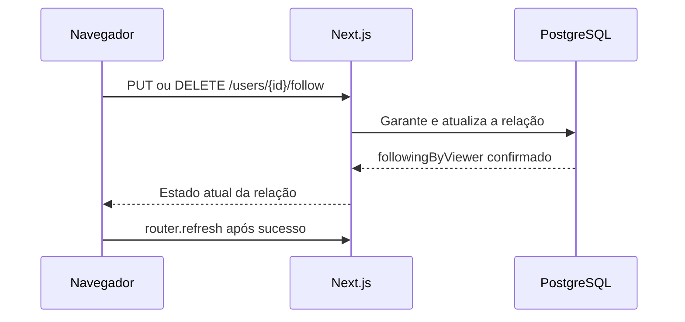
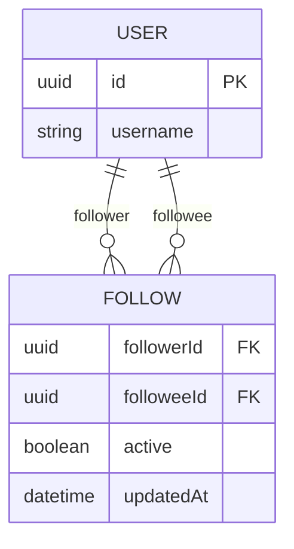

# Exercício 4: seguir e deixar de seguir

## A feature

Complete o botão que permite seguir ou deixar de seguir um perfil. A ação deve mostrar o estado confirmado, impedir cliques repetidos durante a requisição, comunicar falhas e atualizar os dados da página depois do sucesso.

Esta atividade atende ao **RF-04**. Deve caber em 30–45 minutos.

## Contrato e arquivos disponíveis

`changeFollow(userId, following)` usa `PUT` para garantir que a relação exista e `DELETE` para garantir que ela não exista. Retorna `{ followingByViewer }`. Repetir a mesma intenção é seguro; não há endpoint de toggle.

`router` já vem pronto no arquivo. Depois de uma ação confirmada, `router.refresh()` pede ao Next.js que leia novamente os dados da página; basta chamá-lo, sem configurar navegação ou cache.

Altere somente [follow-button.tsx](../src/features/social/follow-button.tsx).

| Arquivo                                                        | Papel                                   |
| -------------------------------------------------------------- | --------------------------------------- |
| [follow-button.tsx](../src/features/social/follow-button.tsx)  | Estado local, clique, mensagem e botão. |
| [client-api.ts](../src/features/social/client-api.ts)          | Chamada HTTP pronta.                    |
| [contracts.ts](../src/features/social/contracts.ts)            | Resultado da ação.                      |
| [profile-header.tsx](../src/features/users/profile-header.tsx) | Recebe o botão por composição.          |

## Fluxo e entidades

## Passo a passo

### 1. Modele o estado da tela

- Qual prop informa o estado inicial?
- Quais valores precisam mudar para atualizar rótulo, `aria-pressed` e `disabled`?
- Que estado só existe enquanto a API responde?

### 2. Expresse a intenção desejada

- Se o usuário segue agora, que valor deve ir para `changeFollow`?
- Por que enviar “seguir” ou “deixar de seguir” é melhor que pedir um toggle remoto?
- Em que ponto a página deve receber `router.refresh()`?

### 3. Trate falha e repetição

- Depois de uma exceção, o botão representa uma mudança confirmada?
- Qual mensagem permite que a pessoa tente novamente?
- Onde `pending` precisa ser liberado, inclusive em erro?

## Verificação e demonstração

Abra o perfil de Marina, deixe de seguir e volte ao feed; seus posts devem sair após a atualização. Siga novamente e confira que posts antigos voltam. Tente clicar várias vezes com a rede lenta e simule uma falha para conferir que a mesma ação pode ser repetida.

## Discussão do grupo

1. Por que a API usa PUT/DELETE em vez de toggle?
2. Por que a relação permanece inativa no banco depois de unfollow?
3. Que disputa existe entre unfollow e uma curtida em andamento?
4. Por que bloquear um par de usuários é melhor que bloquear o usuário inteiro?
