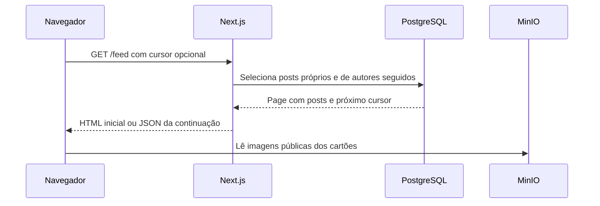
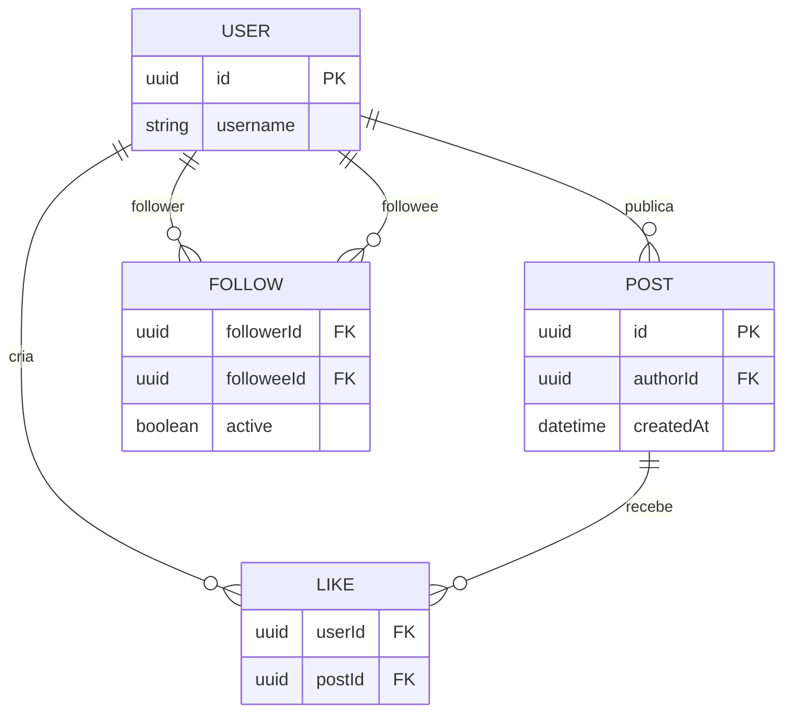

# Exercício 5: consultar o feed cronológico

## A feature

Complete a continuação do feed cronológico. A primeira página já chega do servidor com posts próprios e de autores seguidos. O componente cliente deve guardar o que já aparece, buscar a próxima página e informar carregamento ou falha.

Esta atividade atende ao **RF-05**. Deve caber em 30–45 minutos.

## Contrato e arquivos disponíveis

`getPostsPage("feed", cursor)` retorna `Page<PostDTO>`. A API seleciona os autores elegíveis, monta os dados dos cartões e entrega um cursor opaco. Altere somente [feed-post-list.tsx](../src/features/publication/feed-post-list.tsx).

| Arquivo                                                                | Papel                                  |
| ---------------------------------------------------------------------- | -------------------------------------- |
| [feed-post-list.tsx](../src/features/publication/feed-post-list.tsx)   | Paginação do feed e ações compostas.   |
| [client-api.ts](../src/features/publication/client-api.ts)             | Busca pronta da continuação.           |
| [feed/page.tsx](../src/app/feed/page.tsx)                              | Carrega a primeira página no servidor. |
| [post-collection.tsx](../src/features/publication/post-collection.tsx) | Lista e cartão prontos.                |

## Fluxo e entidades

## Passo a passo

### 1. Diferencie props de estado

- Por que `initialPosts` não basta depois de clicar em “Carregar mais”?
- Que valores devem ser atualizados juntos depois de uma resposta?
- Por que os posts antigos permanecem em caso de erro?

### 2. Faça a próxima leitura

- Que condições impedem uma chamada sem cursor ou em duplicidade?
- Que `kind` deve ser passado para `getPostsPage`?
- Como a função sabe qual resposta ainda pode alterar a lista?

### 3. Termine cada caminho

- Onde limpar um erro antigo?
- Onde encerrar o estado pendente em sucesso, erro e retorno antecipado?
- Quando o botão deve desaparecer?

### 4. Conecte com o restante da tela

- Por que `LikeButton` recebe callback em vez de buscar ou alterar a lista diretamente?
- Por que um refresh após follow reinicia essa lista?

## Verificação e demonstração

No feed inicial, confirme posts de Gabriel e Marina, sem Lucas. Carregue a página seguinte sem repetir cartões. Bloqueie só a requisição de continuação e confira que os posts anteriores continuam visíveis e uma nova tentativa é possível.

## Discussão do grupo

1. O que significa montar o feed na leitura?
2. Compare o custo de publicar e seguir em fan-out on read e fan-out on write.
3. Por que uma página pequena ainda pode resultar em uma consulta cara?
4. Que dado você observaria antes de decidir criar uma tabela de timelines?
