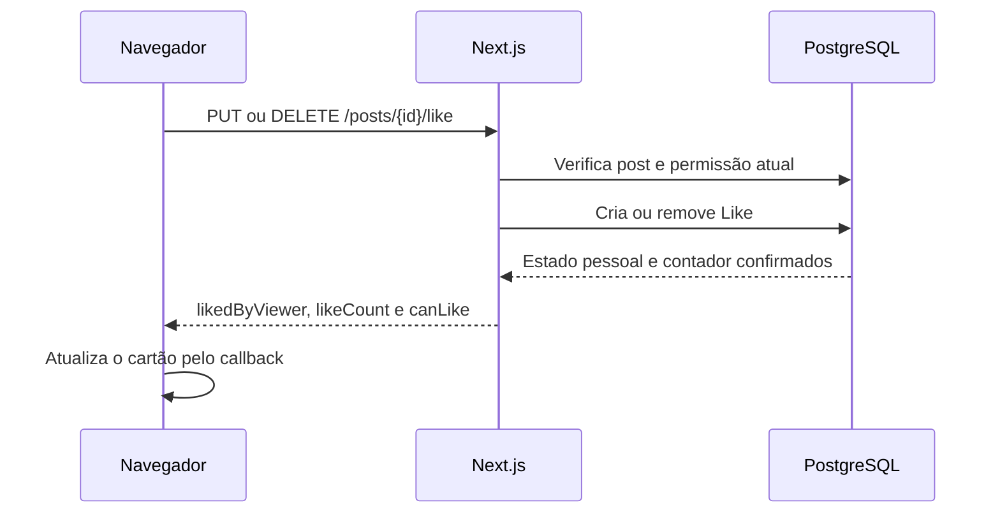
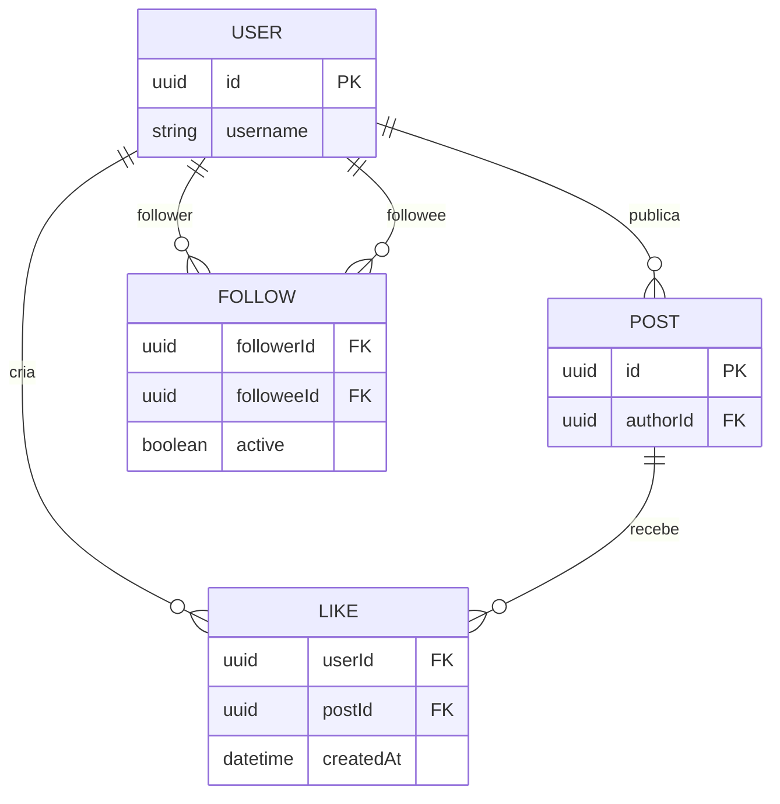

# Exercício 6: curtir e remover curtida

## A feature

Complete o botão de curtida dos cartões. Ele deve enviar a intenção atual, ficar pendente durante a operação, atualizar o contador e o estado pessoal com a resposta da API e mostrar falhas sem afirmar que o banco desfez uma escrita.

Esta atividade atende ao **RF-06**. Deve caber em 30–45 minutos.

## Contrato e arquivos disponíveis

`changeLike(postId, liked)` usa `PUT` para garantir uma curtida e `DELETE` para removê-la. Em sucesso, retorna `likedByViewer`, `likeCount` e `canLike`. O pai do botão recebe o resultado pelo callback `onChanged` e atualiza o cartão.

`router` já vem pronto no arquivo. Depois de confirmar a ação, `router.refresh()` pede ao Next.js que atualize os dados da página; basta chamá-lo, sem configurar navegação ou cache.

Altere somente [like-button.tsx](../src/features/social/like-button.tsx).

| Arquivo                                                              | Papel                                     |
| -------------------------------------------------------------------- | ----------------------------------------- |
| [like-button.tsx](../src/features/social/like-button.tsx)            | Clique, pendência, erro e callback.       |
| [client-api.ts](../src/features/social/client-api.ts)                | Chamada PUT/DELETE pronta.                |
| [contracts.ts](../src/features/social/contracts.ts)                  | Resultado da curtida.                     |
| [feed-post-list.tsx](../src/features/publication/feed-post-list.tsx) | Mostra como o resultado atualiza um post. |

## Fluxo e entidades

## Passo a passo

### 1. Leia as props do botão

- Qual prop informa se o próximo pedido deve criar ou remover a curtida?
- Por que `canLike` pode desabilitar o botão mesmo sem uma requisição pendente?
- Por que o botão não mantém seu próprio contador?

### 2. Confirme a ação

- Que valor `changeLike` recebe quando `liked` é verdadeiro? E quando é falso?
- Quando chamar `onChanged`?
- Por que atualizar com o resultado retornado é mais seguro que somar ou subtrair localmente?

### 3. Faça a interface se recuperar

- O que fica bloqueado durante a chamada?
- Depois de uma exceção, qual é o último estado confirmado?
- Por que repetir a mesma intenção é preferível a alternar o ícone localmente?

### 4. Revise acessibilidade

- Como `aria-pressed` descreve o estado?
- Qual texto alternativo o botão usa em cada situação?
- A mensagem de erro chega ao leitor de tela?

## Verificação e demonstração

Curta e remova a curtida de uma foto própria e uma foto de Marina. Confira contador e ícone após cada resposta. Tente curtir post de Lucas sem segui-lo. Com uma falha de rede, confira que o botão libera nova tentativa e não inventa um contador novo.

## Discussão do grupo

1. Por que PUT/DELETE tornam a repetição mais segura que um toggle?
2. Por que o contador vem do servidor em vez de ser calculado pelo botão?
3. Qual contenção existe entre like e unfollow?
4. Quando um contador materializado seria considerado e que custo ele criaria?
